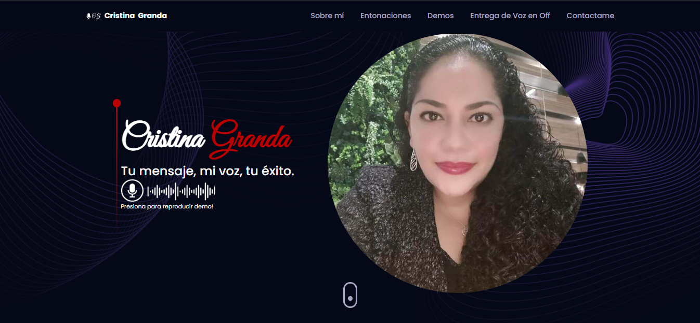
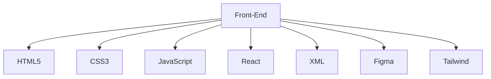
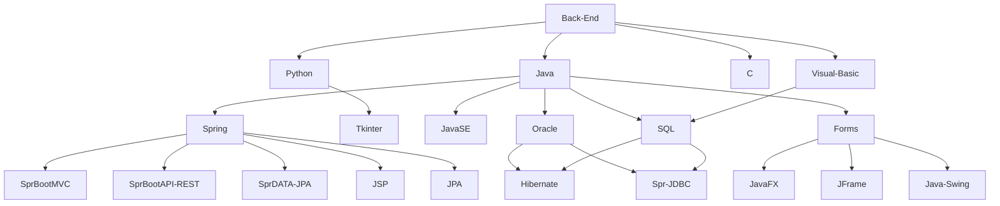

# 🏄‍♂️ Paulo Salazar <picture></picture> 

<!-------------------------------------------------------------------------------------------------------->
 
**`Digital Craftsman (Developer/3DArtist)`**
<!-------------------------------------------------------------------------------------------------------->

<picture>
  <source media="(max-width: 767px)" srcset="">
  
</picture>

 I'm an indie full-stack developer and 3D artist building my version of the digital world one step at a time. All coding projects are built from the ground up, from planning and designing all the way to solving real-life problems with code. 

<!-------------------------------------------------------------------------------------------------------->
   

         </a>
      
   

<!-------------------------------------------------------------------------------------------------------->

---

### 🧰 LANGUAGES AND TOOLS

  

   

 
 
  

---
<!-------------------------------------------------------------------------------------------------------->

### 

  <h2>👨🏻‍💻 PROJECTS</h2> 
  <table align="left" >
    <tr border="none">
      <td width="25%" align="center">
        

         
          

        

            
          
        

      </td>
    </tr>
  </table>

 
  
 
   
  
<!-------------------------------------------------------------------------------------------------------->

---

## <b> STATS </b>

<!-------------------------------------------------------------------------------------------------------->

  
   
  
  

 

<!-------------------------------------------------------------------------------------------------------->

 
  
<!-------------------------------------------------------------------------------------------------------->

<!-------------------------------------------------------------------------------------------------------->

## <b> SKILLS</b>

<!-------------------------------------------------------------------------------------------------------->

 
<b>Visitors Count SalazarPaulo </b>
  

 
 

<!-------------------------------------------------------------------------------------------------------->

<!-------------------------------------------------------------------------------------------------------->

### 🧰 SNYKEN

<!-------------------------------------------------------------------------------------------------------->

 

 
 
 
