# 🏄‍♂️ Paulo Salazar <picture></picture> 

<!-------------------------------------------------------------------------------------------------------->
 
**`Digital Craftsman (Developer/3DArtist)`**
<!-------------------------------------------------------------------------------------------------------->

<picture>
  <source media="(max-width: 767px)" srcset="">
  
</picture>

 I'm an indie full-stack developer and 3D artist building my version of the digital world one step at a time. All coding projects are built from the ground up, from planning and designing all the way to solving real-life problems with code. 

<!-------------------------------------------------------------------------------------------------------->
   

         </a>
      
   

<!-------------------------------------------------------------------------------------------------------->

---

### 🧰 LANGUAGES AND TOOLS

  

   

 
 
  

---
<!-------------------------------------------------------------------------------------------------------->
### 

  <h2>👨🏻‍💻 PROJECTS</h2> 
  <table width="100%">
    <tr>
      <!-- next project 1 -->
      <td width="50%" align="center" valign="top">
        <h3>🎙️ Portfolio Cristina Granda</h3>
        
          
        
        
      </td>
      <!-- next project 2 -->
      <td width="50%" align="center" valign="top">
        <h3>🚀 Space Ship Game</h3>
        <a href="https://github.com/SalazarPaulo/space_ship" title="Go to Link">
          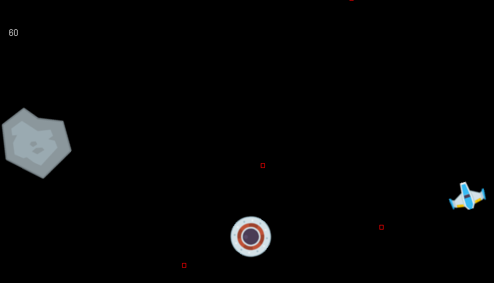
        </a>
          
        
      </td>
    </tr>
    <!-- next project 3 -->
    <tr>
      <td width="50%" align="center" valign="top">
        <h3>🏦 Bank Project</h3>
        <a href="https://github.com/SalazarPaulo/Bank-Project" title="Go to Link">
          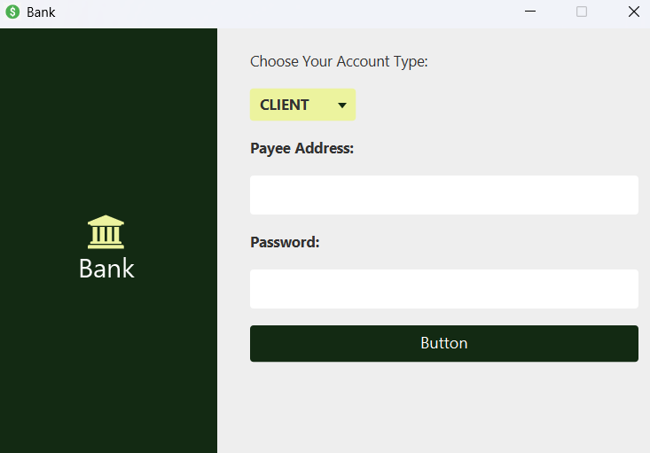
        </a>
          
        
      </td>
      <!-- next project 4 -->
      <td width="50%" align="center" valign="top">
        <h3>📸 Camera Gallery</h3>
        <a href="https://github.com/SalazarPaulo/CameraGalery" title="Go to Link">
          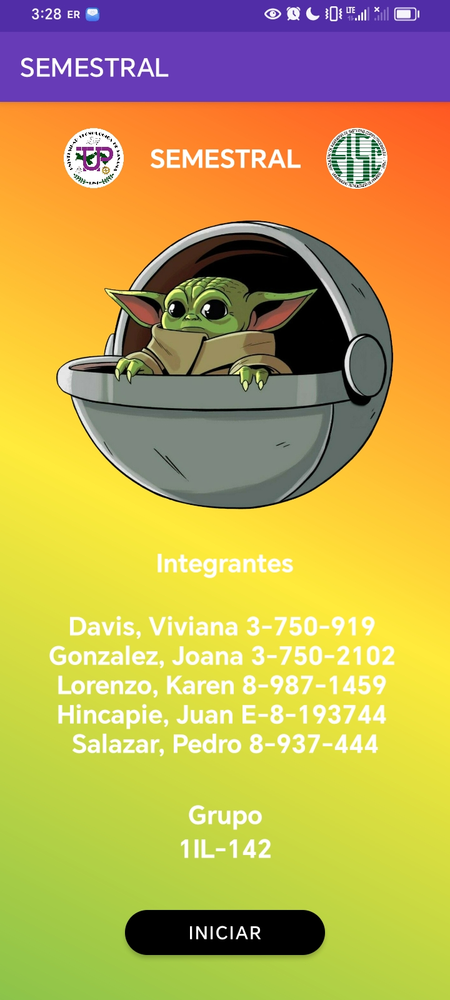
        </a>
          
        
      </td>
    </tr>
    <tr>
      <!-- next project 5 -->
      <td width="50%" align="center" valign="top">
         
        <h3>🚢 Battle Ship Game</h3>
        <a href="https://github.com/SalazarPaulo/Battle_Ship/tree/main/" title="Go to Link">
          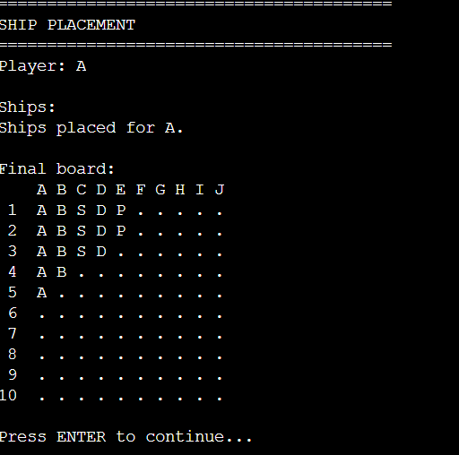
        </a>
          
        
      </td>
      <!-- next project 6 -->
      <td width="50%" align="center" valign="top">
         
        <h3>🎓 Matricula System VB.NET</h3>
        <a href="https://github.com/SalazarPaulo/matricula-system-vbnet" title="Go to Link">
          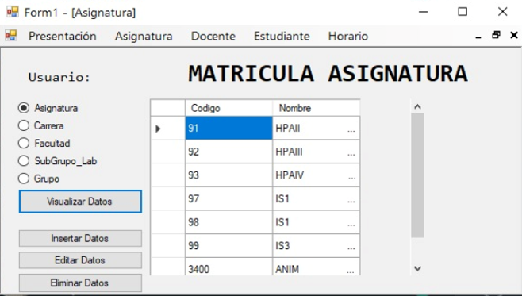
        </a>
          
        
      </td>
    </tr>
       <tr>
      <!-- next project 7 -->
      <td width="50%" align="center" valign="top">
         
        <h3>🕹️ DEV ARCADE Portfolio</h3>
        <a href="https://salazarpaulo.github.io/" title="Go to Live Site">
          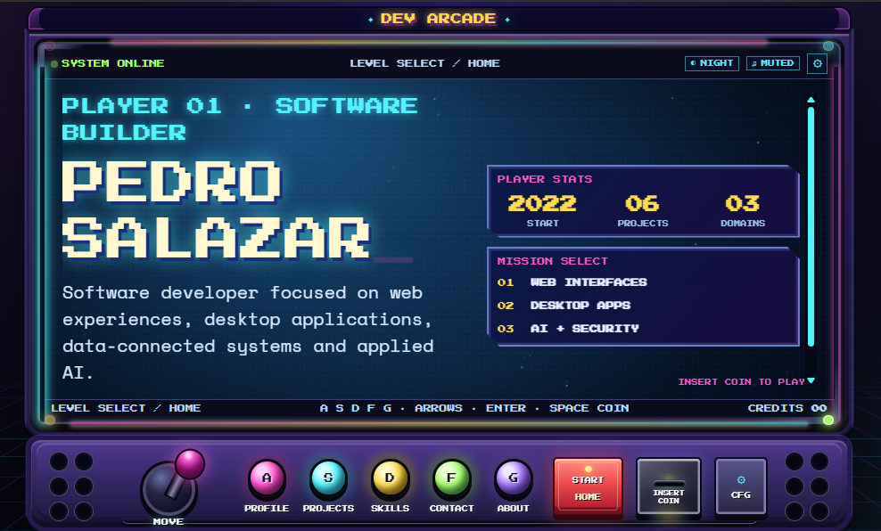
        </a>
          
        
        
      </td>
      <!-- next project 8 -->
      <td width="50%" align="center" valign="top">
         
        <h3>🛡️ IDS-ML Thesis</h3>
        
          
        
      </td>
    </tr>
    <tr>
      <!-- next project 9 -->
      <td width="50%" align="center" valign="top">
         
        <h3>🐱 Noraneko: Cat Game</h3>
        <a href="https://github.com/SalazarPaulo/REEMPLAZAR-CON-REPO" title="Go to Repository">
          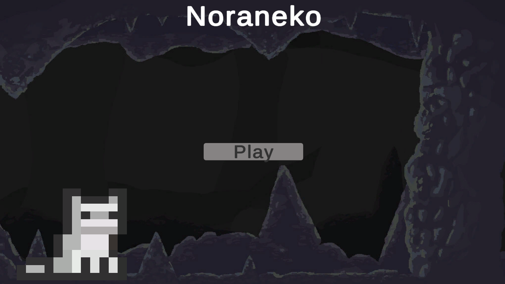
        </a>
          
        
      </td>
      <td width="50%" align="center" valign="top">
        &nbsp;
      </td>
    </tr>
  </table>

 

<!-------------------------------------------------------------------------------------------------------->

  <h2>🧪 MINI PROJECTS</h2> 
  <table width="100%">
    <tr>
      <!-- next mini project 1 -->
      <td width="50%" align="center" valign="top">
        <h3>⚔️ Pokémon Battle AI</h3>
        <a href="https://github.com/SalazarPaulo/pokemon-battle-ai-minimax" title="Go to Link">
          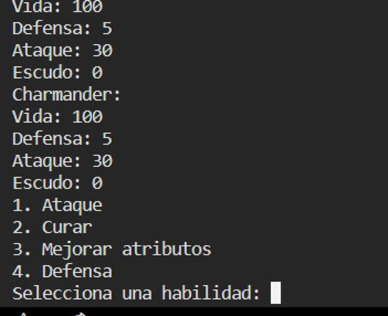
        </a>
          
        
      </td>
      <!-- next mini project 2 -->
      <td width="50%" align="center" valign="top">
        <h3>♛ N Queens Search Visualizer</h3>
        <a href="https://github.com/SalazarPaulo/n-queens-search-visualizer" title="Go to Link">
          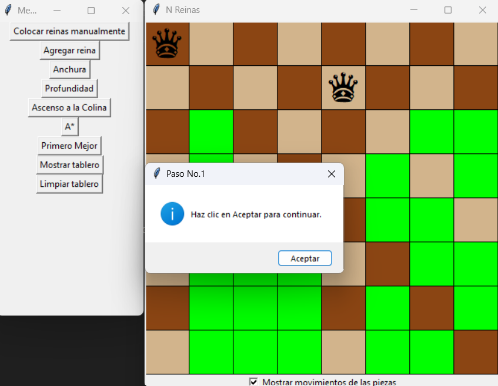
        </a>
          
        
      </td>
    </tr>
  </table>

 
<!-------------------------------------------------------------------------------------------------------->
<!-------------------------------------------------------------------------------------------------------->

## <b> STATS </b>
---

<!-------------------------------------------------------------------------------------------------------->

  
   
  
  

 

<!-------------------------------------------------------------------------------------------------------->

 
  
<!-------------------------------------------------------------------------------------------------------->

<!-------------------------------------------------------------------------------------------------------->

## <b> SKILLS</b>

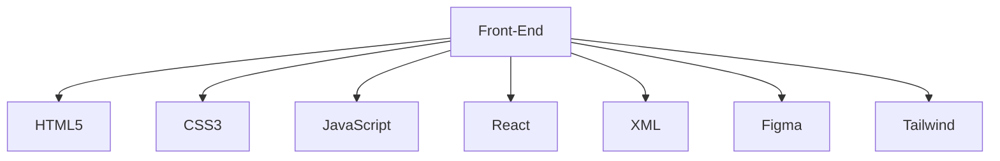
```mermaid
graph TD;
    Front-End-->HTML5;
    Front-End-->CSS3;
    Front-End-->JavaScript;
    Front-End-->React;
    Front-End-->XML;
    Front-End-->Figma;
    Front-End-->Tailwind;
```

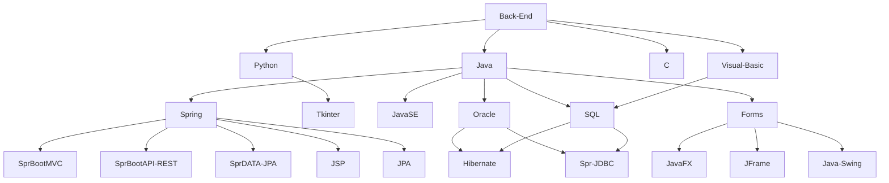
```mermaid
graph TD;
    Back-End-->Java;
    Back-End-->Python;
    Back-End-->C;
    Back-End-->Visual-Basic;
    Visual-Basic-->SQL;
    Python-->Tkinter;
    Java-->JavaSE;
    Java-->Spring;
    Java-->SQL;
    Java-->Oracle;
    Spring-->SprBootMVC;
    Spring-->SprBootAPI-REST;
    Spring-->SprDATA-JPA;
    Spring-->JSP;
    Spring-->JPA;
    SQL-->Hibernate;
    SQL-->Spr-JDBC;
    Oracle-->Hibernate;
    Oracle-->Spr-JDBC;
    Java-->Forms;
    Forms-->JavaFX;
    Forms-->JFrame;
    Forms-->Java-Swing;
```

<!-------------------------------------------------------------------------------------------------------->

 
<b>Visitors Count SalazarPaulo </b>
  

 
 

<!-------------------------------------------------------------------------------------------------------->

<!-------------------------------------------------------------------------------------------------------->

### 🧰 SNYKEN

<!-------------------------------------------------------------------------------------------------------->

 

 
 
 
